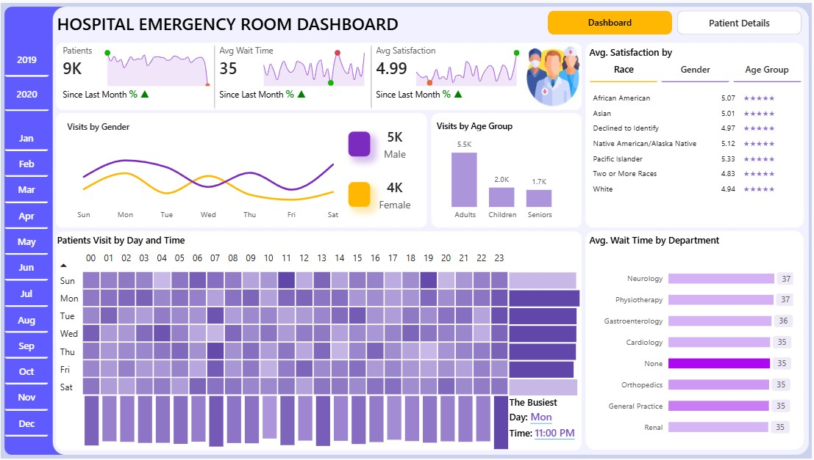
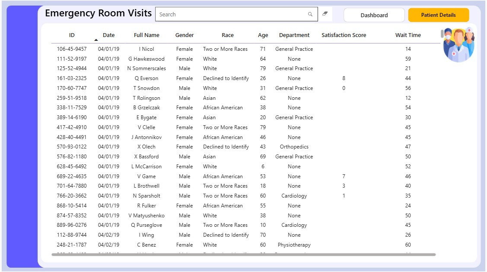

# Hospital Emergency Room Analysis Dashboard | Power BI

> An interactive Power BI dashboard for analyzing patient flow, waiting time, satisfaction, demographics, and Emergency Room operational performance.

## Dashboard Preview




### 🔗 Live Power BI Dashboard

[View Interactive Dashboard](https://app.powerbi.com/groups/me/reports/5826ffaa-d571-4429-8d55-34b00e8fc0e0/1618224e8093eea3ed2e?experience=power-bi)

---

## Project Overview

This project transforms **9,216 Emergency Room patient records** into an interactive analytical dashboard.

The dashboard helps explore:

- Patient visit trends
- Average waiting time
- Patient satisfaction
- Demographic patterns
- Department-level waiting time
- Daily and hourly patient flow
- Month-over-month performance

The goal is to turn raw patient data into clear, actionable insights that can support operational monitoring and further investigation.

---

## Key Insights

- **9,216** patient records analyzed
- **35.3 minutes** average waiting time
- **5.0** average recorded satisfaction score
- **Adults aged 18–64** represent the largest patient group
- **Monday** has the highest patient volume with **1,377 visits**
- **11 PM** is the busiest hour with **436 visits**
- Department-level average waiting times range from approximately **34.7–36.8 minutes**

> **Data note:** Satisfaction scores are missing for some records, so the average satisfaction KPI represents records with an available score.

---

## Tools & Skills

**Power BI · Power Query · DAX · Data Modeling**

- Data Cleaning & Transformation
- DAX & Time Intelligence
- KPI Development
- Trend Analysis
- Demographic Analysis
- Interactive Dashboard Design
- Dynamic Field Parameters
- Data Storytelling

---

## Business Impact

The analysis highlights high-demand periods, waiting-time patterns, patient demographics, and satisfaction trends.

The findings suggest opportunities to:

- Review staffing and resource allocation during high-demand periods
- Monitor department-level waiting times
- Track satisfaction alongside operational metrics
- Explore demographic patterns for deeper analysis

---

## Repository Structure

```text
hospital-emergency-room-analysis-powerbi/
│
├── Screenshots/
│   ├── DASHBOARD.jpg
│   └── PATIENT_DETAILS.jpg
│
├── Documentation/
│   └── HOSPITAL_ROOM_ANALYSIS_DASHBOARD.pdf
│
└── Hospital ER Analysis Dashboard.pbix
```

## Project Documentation

For the complete project methodology, data preparation, DAX calculations, analysis, findings, and recommendations:

[View Project Documentation](https://github.com/Rifat250/hospital-emergency-room-analysis-powerbi/blob/main/Documentation/HOSPITAL_EMERGENCY_ROOM_ANALYSIS_DASHBOARD.pdf)

👤 Author

Maksud-Ur-Rashid

Data Analyst | Power BI | Excel | SQL | Python
